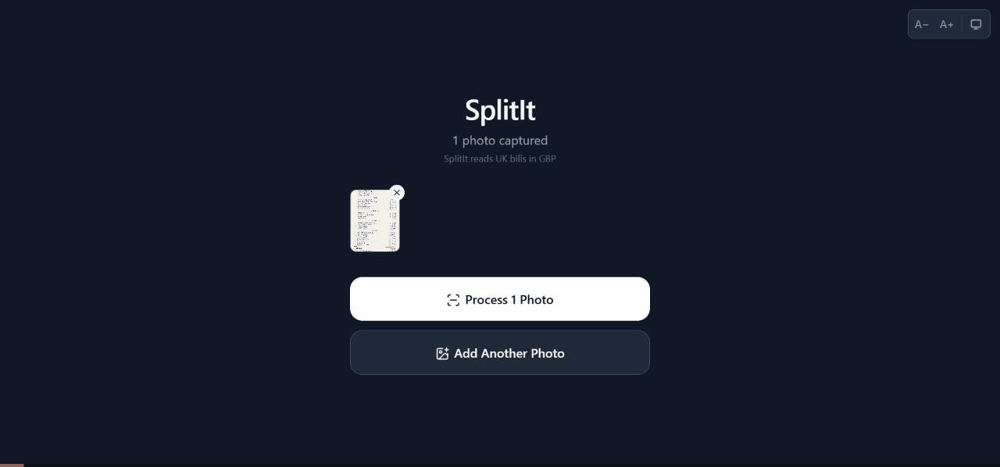

# SplitIt

**Split restaurant bills fairly — snap a photo, claim your items, and let SplitIt handle the math.**

A Progressive Web App that makes splitting the bill painless. Photograph a receipt, let OCR or your own AI (ChatGPT, Claude or Gemini) extract the line items, pass the phone around the table so everyone claims what they ordered, and get an instant per-person breakdown with proportional tax and tip.

## Three ways to read a bill

| Method | Accuracy | Needs | How |
| --- | --- | --- | --- |
| **AI Assistant — bring your own key** | Best | Your own OpenAI, Claude or Gemini API key | Paste your key once, then photograph the bill and tap **Process with AI**. Items arrive pre-filled. |
| **AI Assistant — copy & paste** | Best | A free ChatGPT or Claude chat | Copy SplitIt's prompt, attach your photo in the chatbot, paste the JSON reply back. No key needed. |
| **Scan a Bill (OCR)** | Good | Nothing — works offline | Tesseract.js reads the photo on-device; nothing is uploaded. |

You can also **Enter Manually**. Whichever way you start, you review and correct the items before splitting.

> **Bring your own key (BYOK):** on the home screen choose **Use AI Assistant**, then **Have an API key? Skip the copy-paste**. Pick OpenAI, Claude or Gemini and paste your key. It is stored only in your browser (local storage) and removed with **Remove key**. While a receipt is processed, the photo and key pass through a stateless serverless proxy (`netlify/functions/ai-receipt.ts`) to the provider; SplitIt never stores either. You pay your provider directly for usage.

<p align="center">
  
</p>

## How it works

1. **Scan** — Photograph the bill. Use on-device OCR (nothing is uploaded) or the AI Assistant with your own API key for the most accurate read.
2. **Review** — Fix any misread lines and check the total against the receipt.
3. **Add people** — Everyone at the table, with a colour each.
4. **Claim** — Pass the phone around (or use live sessions on separate phones) and tap what you ordered. Tap the split icon to share a dish.
5. **Tip** — Each person picks their own tip percentage.
6. **Settle** — A clear per-person breakdown, ready to copy and send.

## Features

- **AI bill reading (BYOK)** — Bring your own OpenAI, Claude or Gemini key for the most accurate extraction, or use the key-free copy-and-paste flow with any chatbot
- **Photo-to-items** — Snap a picture of the bill; Tesseract.js extracts line items locally (no upload required)
- **Claim-based splitting** — Each person taps the items they ordered; shared items are divided evenly
- **Proportional tax & tip** — Tax and tip are distributed based on each person's subtotal
- **Live sessions** — Share a QR code so everyone can claim items from their own phone via WebSocket relay
- **Works offline** — Service-worker-powered PWA; scanning, claiming and splitting need no connection after first load (AI reading and live sessions are online)
- **Dark mode** — Automatic and manual theme switching
- **Installable** — Add to home screen on any device

## Tech Stack

- **UI:** React 19, TypeScript, Tailwind CSS v4
- **Build:** Vite 7 with `vite-plugin-pwa` (Workbox)
- **State:** Zustand
- **OCR:** Tesseract.js (WASM, runs entirely in-browser)
- **AI (optional, BYOK):** OpenAI, Anthropic or Gemini via a Netlify Function proxy (`netlify/functions/ai-receipt.ts`)
- **Routing:** React Router v7
- **Realtime:** WebSocket relay on Deno Deploy (`server/main.ts`)
- **Testing:** Vitest + React Testing Library

## Getting Started

```bash
npm install
npm run dev        # Start dev server at http://localhost:5173
```

## Scripts

| Command               | Description                                  |
| --------------------- | -------------------------------------------- |
| `npm run dev`         | Start development server                     |
| `npm run build`       | Type-check and production build              |
| `npm run preview`     | Preview production build locally             |
| `npm run test`        | Run tests in watch mode                      |
| `npm run test:run`    | Run tests once                               |
| `npm run test:coverage` | Run tests with coverage report             |
| `npm run lint`        | Run ESLint                                   |
| `npm run format`      | Format code with Prettier                    |
| `npm run typecheck`   | TypeScript type checking                     |
| `npm run check`       | Run **all** checks (typecheck + lint + format + tests) |

## Deployment

### Frontend (Netlify)

Every push to `master` triggers an automatic build and deploy.

- **Build command:** `npm run build`
- **Publish directory:** `dist`
- **SPA redirect:** All routes fall back to `index.html` (configured in `netlify.toml`)

### Relay Server (Deno Deploy)

Live sessions use a lightweight WebSocket relay server hosted on [Deno Deploy](https://deno.com/deploy). The server is stateless — it forwards JSON messages between host and guests in ephemeral rooms. No data is stored.

- **Source:** `server/main.ts`
- **Runtime:** [Deno](https://deno.com/)
- **Run locally:** `cd server && deno task dev`
- **Health check:** `GET /health` returns `{ status: "ok", rooms: N }`
- **Client config:** `src/services/liveSession/relayConfig.ts` (override with `VITE_RELAY_URL` env var)

## Project Structure

```
src/
  components/   # Reusable UI components
  pages/        # Route-level page components
  hooks/        # Custom React hooks
  store/        # Zustand state stores
  services/     # OCR, P2P, and other service modules
  types/        # TypeScript type definitions
  utils/        # Helper utilities
  test/         # Test setup and utilities
```

## License

MIT
